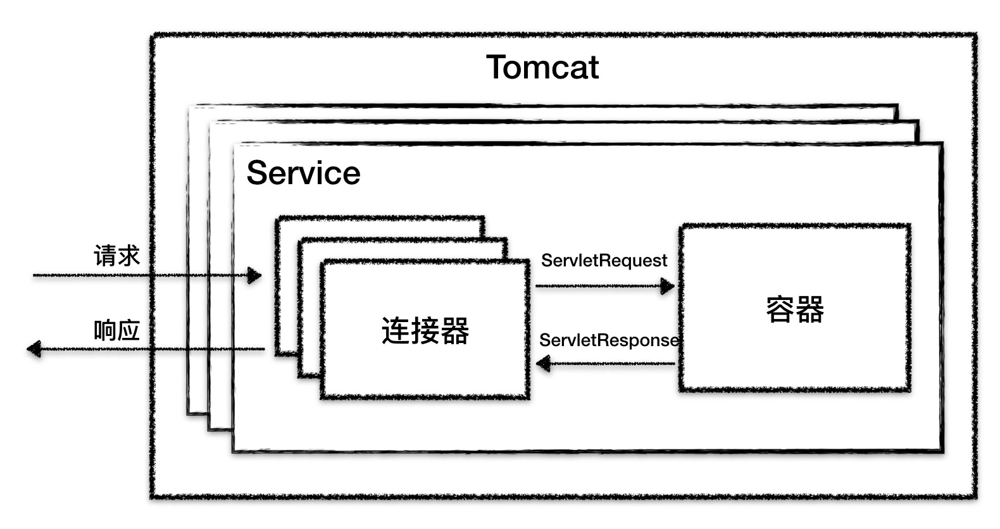
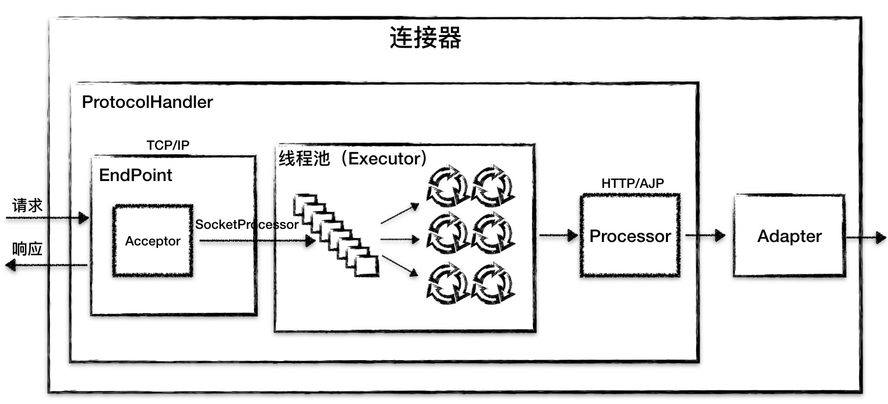
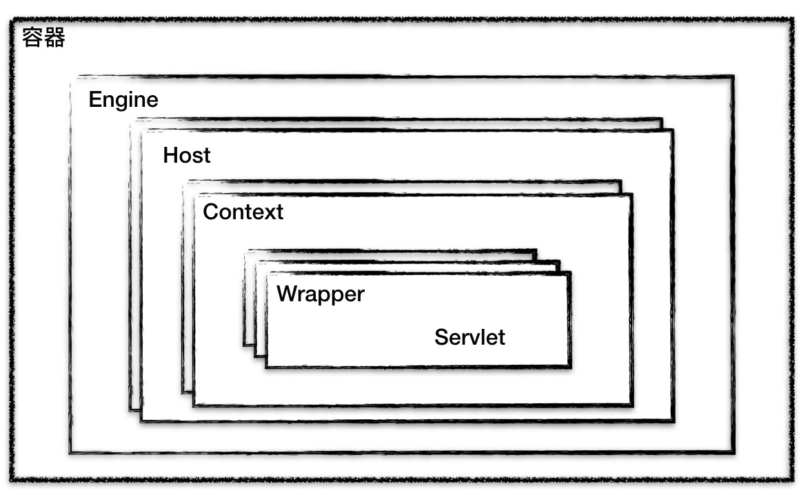
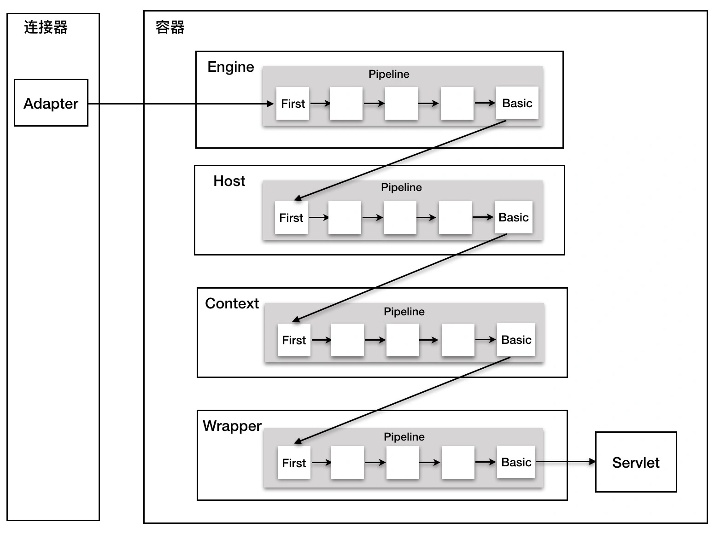

# mini-tomcat

## TOMCAT总体架构



### 连接器
```text
处理 Socket 连接，负责网络字节流与 Request 和 Response 对象的转化
``` 


> Endpoint 接收到 Socket 连接后，生成一个 SocketProcessor 任务提交到线程池去处理，SocketProcessor 的 run 方法会调用 Processor 组件去解析应用层协议，Processor 通过解析生成 Request 对象后，会调用 Adapter 的 Service 方法
* **Endpoint** （负责网络通信）
* **Processor**（负责应用层协议解析）
* **Adapter**（负责Tomcat Request/Response 与 ServletRequest/ServletResponse的转化）

### 容器
```text
加载和管理 Servlet，以及具体处理Request 请求。
``` 
> Tomcat 设计了 4 种容器，分别是 Engine、Host、Context 和 Wrapper。这四种容器是父子关系。


* **Context** （表示一个 Web 应用程序）
* **Wrapper** (表示一个Servlet)
* **Host** (表示一个虚拟主机，或者说一个站点，可以给 Tomcat 配置多个虚拟主机地址，而一个虚拟主机下可以部署多个 Web 应用程序)
* **Engine** （表示引擎，用来管理多个虚拟站点，一个Service最多只能有一个Engine）


#### 容器中Pipeline调用
